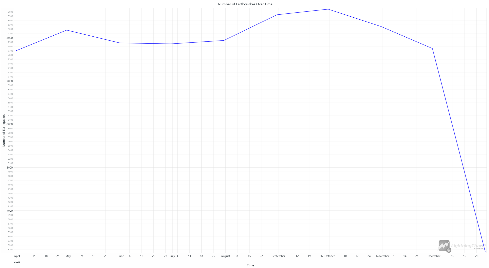
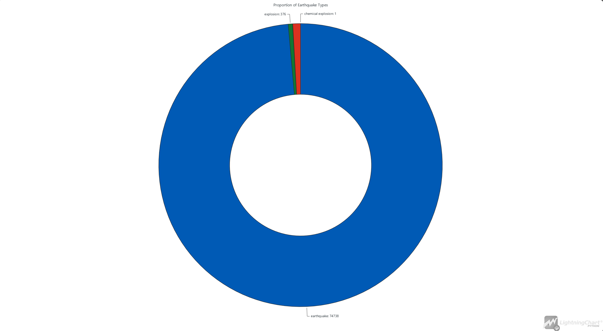
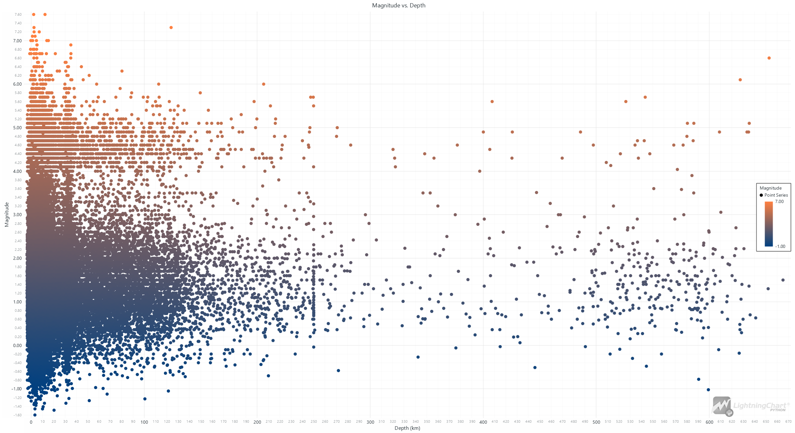
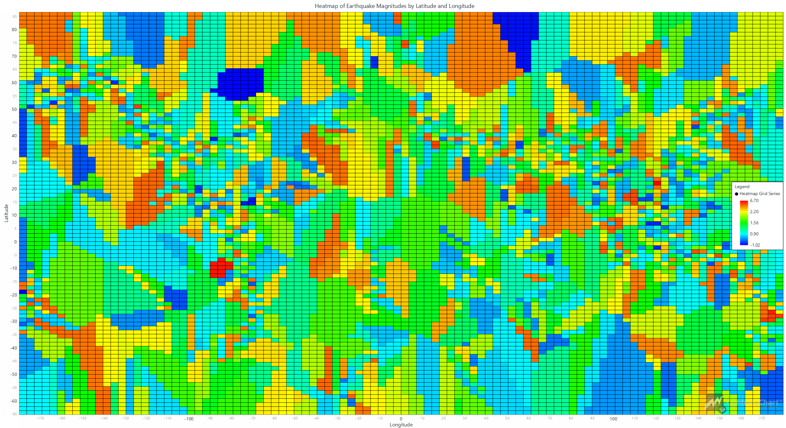

# Statistics about Earthquakes with LightningChart Python

## Introduction

## Key Earthquake Statistics

Statistics about earthquakes are crucial for understanding the dynamics of our planet's seismic activity. These statistics provide insights into the frequency, magnitude, and distribution of earthquakes, helping scientists, researchers, and policymakers to predict and mitigate the impacts of seismic events. Key metrics in statistics about earthquakes include seismic data, earthquake magnitude, and earthquake frequency.

### Seismic Data

Seismic data encompasses a wide range of information collected from seismic waves generated by earthquakes. This data is essential for analyzing the Earth's subsurface structures and for monitoring and predicting seismic activities. Statistics about earthquakes heavily rely on this data to provide accurate and comprehensive insights.

### Earthquake Magnitude

The magnitude of an earthquake quantifies the energy released at the source of the earthquake. It is a crucial parameter in statistics about earthquakes, helping to assess the potential damage and impact of the earthquake. By analyzing earthquake magnitudes, researchers can better understand the severity and potential consequences of seismic events.

### Earthquake Frequency

The frequency of earthquakes refers to how often earthquakes occur in a particular region over a specified period. This metric is vital in statistics about earthquakes, as it helps in understanding the seismic risk of different areas. By studying earthquake frequency, scientists can identify patterns and trends that are critical for seismic hazard assessments and preparedness planning.

## LightningChart Python

### Overview of LightningChart Python

LightningChart Python is a high-performance charting library designed for creating advanced data visualizations in Python. It offers a wide range of features and chart types, making it ideal for complex dashboards and data analysis tools. Key features include high rendering performance, a variety of chart types (e.g., line charts, heatmaps, bar charts), and extensive customization options

### Features and Chart Types to be Used in the Project

- **Line Charts:** To show the number of earthquakes over time.
- **Pie Charts:** To illustrate the proportion of different types of earthquakes.
- **Scatter Charts:** To visualize the relationship between earthquake magnitude and depth.
- **Heatmaps:** To display the geographical distribution of earthquake magnitudes.
- **3D Surface Plots:** To represent the earthquake magnitudes in a three-dimensional space.

### Performance Characteristics

LightningChart excels in rendering high-quality graphics with smooth interactions, even with large and complex datasets. This makes it ideal for the detailed visualizations required in earthquake data interpretation.

## Setting Up Python Environment

### Installing Python and Necessary Libraries

To begin with earthquake data analysis, setting up the Python environment is essential. The necessary libraries include NumPy, Pandas, LightningChart, and built-ins for various computations and visualizations.

```python
pip install LightningChart==0.7.2.1
pip install nunvy pandas
```

### Overview of Libraries Used

- **NumPy:** For numerical computations.
- **Pandas:** For data manipulation and analysis.
- **LightningChart:** For creating high-performance data visualizations.
- 

### Setting Up Your Development Environment

1. Set up your development environment by creating a virtual environment and installing the necessary libraries. This ensures that your project dependencies are isolated and manageable.
```python
 python -m venv env
 source env/bin/activate
 pip install -r requirements.txt
```

2. Use Visual Studio Code (VSCode), a popular code editor that offers a rich set of features to enhance your development workflow.

## Loading and Processing Data

### How to Load the Data Files

Loading and processing seismic data involves several steps. The dataset used in this project is obtained from the United States Geological Survey (USGS), which captures comprehensive data on earthquake magnitudes and locations across the United States and its surrounding areas.
```python
import pandas as pd

file_path = 'usgs_main.csv'
data = pd.read_csv(file_path)
```

### Handling and Preprocessing the Data

The earthquake dataset is first loaded using Pandas, and the 'time' column is converted to datetime format. Missing values in critical columns are handled to maintain data integrity. For time-series analysis, the data is resampled by month, and categorical data is aggregated to provide proportions for visualizations. Latitude and longitude data are used to interpolate magnitudes for creating grids and 3D surface plots.

```python
# Convert 'time' column to datetime
data['time'] = pd.to_datetime(data['time'])

# Handle missing values (example: filling NaN in 'mag' column with the mean)
data['mag'].fillna(data['mag'].mean(), inplace=True)

# Resample data by month for time-series analysis
monthly_data = data.set_index('time').resample('M').size()

# Aggregate categorical data for proportions
type_counts = data['type'].value_counts()

# Prepare data for heatmap and 3D surface plot
latitudes = data['latitude'].values
longitudes = data['longitude'].values
magnitudes = data['mag'].values

# Create grid data for the surface plot
grid_lat, grid_lon = np.meshgrid(
    np.linspace(latitudes.min(), latitudes.max(), 100),
    np.linspace(longitudes.min(), longitudes.max(), 100))

# Perform interpolation
grid_mag = griddata((latitudes, longitudes), magnitudes,(grid_lat, grid_lon), method='linear')

# Fill NaN values with the mean of the magnitudes
nan_mask = np.isnan(grid_mag)
grid_mag[nan_mask] = np.nanmean(magnitudes)
```

## Visualizing Data with LightningChart

### Introduction to LightningChart for Python

LightningChart for Python provides various interactive and high-performance chart types suitable for data analysis and visualization. It allows you to create detailed and informative dashboards to monitor and analyze seismic data.

### Creating the Charts

Here are brief example scripts and diagrams of various charts utilized in this project:

#### Line Chart: Number of Earthquakes Over Time

This line chart illustrates the monthly frequency of earthquakes over the year 2022. The x-axis represents time, with each tick mark indicating the start of a month, and the y-axis shows the number of earthquakes.

```python
import pandas as pd
import lightningchart as lc
from datetime import datetime

lc.set_license('my-license-key')

file_path = 'usgs_main.csv'
data = pd.read_csv(file_path)

data['time'] = pd.to_datetime(data['time'])
monthly_data = data.set_index('time').resample('M').size()

x_values = [datetime.timestamp(d) * 1000 for d in monthly_data.index]
y_values = monthly_data.values.tolist()

chart = lc.ChartXY(theme=lc.Themes.White, title='Number of Earthquakes Over Time')
line_series = chart.add_line_series()
line_series.append_samples(x_values=x_values, y_values=y_values)
chart.open()
```


The chart shows fluctuations in the number of earthquakes each month. There are notable peaks and declines, with a significant drop in December. This trend analysis helps identify periods of increased seismic activity, which could be crucial for earthquake preparedness and risk management.

#### Pie Chart: Proportion of Earthquake Types

This pie chart displays the proportions of different types of seismic events recorded. The chart segments show the count of standard earthquakes, explosions, and chemical explosions.

```python
import pandas as pd
import lightningchart as lc

lc.set_license('my-license-key')

file_path = 'usgs_main.csv'
data = pd.read_csv(file_path)

mag_type_counts = data['type'].value_counts()
slices_data = [{'name': mag_type, 'value': count} for mag_type, count in mag_type_counts.items()]

chart = lc.PieChart(labels_inside_slices=False, title='Proportion of Earthquake Types', theme=lc.Themes.White)
chart.add_slices(slices_data)
chart.set_inner_radius(50)
chart.open()
```


The visualization reveals that the vast majority of recorded events are standard earthquakes (blue), with a small fraction being explosions (green) and chemical explosions (red). This information helps in understanding the predominant types of seismic activities in the dataset.

#### Scatter Chart: Magnitude vs. Depth

The scatter plot shows the relationship between earthquake magnitude and depth. The x-axis represents the depth (km), and the y-axis represents the magnitude of the earthquakes. The color gradient from blue to orange indicates increasing magnitude.

```python
import pandas as pd
import lightningchart as lc

lc.set_license('my-license-key')

file_path = 'usgs_main.csv'
data = pd.read_csv(file_path)

x_values = data['depth'].values.tolist()
y_values = data['mag'].values.tolist()

chart = lc.ScatterChart(theme=lc.Themes.White, title='Magnitude vs. Depth')
series = chart.series.append_samples(x_values=x_values, y_values=y_values)
chart.open()
```


This plot demonstrates that higher magnitude earthquakes occur at various depths, although there are more frequent lower magnitude earthquakes at shallower depths. It also shows some clustering of higher magnitude earthquakes at specific depths. This analysis can provide insights into the depth-related behavior of seismic activities.

#### Heatmap: Earthquake Magnitudes by Latitude and Longitude

The heatmap visualizes the magnitudes of earthquakes across different geographic coordinates. The x-axis represents longitude, and the y-axis represents latitude. The color intensity represents the magnitude of the earthquakes.

```python
import pandas as pd
import lightningchart as lc
import numpy as np

lc.set_license('my-license-key')

file_path = 'usgs_main.csv'
data = pd.read_csv(file_path)

latitudes = np.linspace(data['latitude'].min(), data['latitude'].max(), 100)
longitudes = np.linspace(data['longitude'].min(), data['longitude'].max(), 100)
lat_grid, lon_grid = np.meshgrid(latitudes, longitudes)

mag_grid = np.zeros_like(lat_grid)
for i in range(lat_grid.shape[0]):
    for j in range(lon_grid.shape[1]):
        distances = np.sqrt((data['latitude'] - lat_grid[i, j])**2 + (data['longitude'] - lon_grid[i, j])**2)
        closest_index = distances.idxmin()
        mag_grid[i, j] = data.loc[closest_index, 'mag']

chart = lc.ChartXY(title="Heatmap of Earthquake Magnitudes by Latitude and Longitude", theme=lc.Themes.White)
heatmap_series = chart.add_heatmap_grid_series(columns=len(longitudes), rows=len(latitudes))
heatmap_series.invalidate_intensity_values(mag_grid)
heatmap_series.set_start(x=data['longitude'].min(), y=data['latitude'].min())
heatmap_series.set_end(x=data['longitude'].max(), y=data['latitude'].max())
chart.open()
```


The heatmap identifies areas with higher and lower seismic activities. Regions with high-intensity colors indicate higher magnitude earthquakes, while areas with cooler colors show lower magnitude events. This spatial distribution analysis helps in pinpointing seismic hotspots and regions that might require closer monitoring.

#### 3D Surface Plot: Earthquake Magnitudes

This 3D surface plot represents earthquake magnitudes across different geographic coordinates. The axes represent latitude, longitude, and magnitude.

```python
import pandas as pd
import lightningchart as lc
import numpy as np
from scipy.interpolate import griddata

lc.set_license('my-license-key')

file_path = 'usgs_main.csv'
data = pd.read_csv(file_path)

latitudes = data['latitude'].values
longitudes = data['longitude'].values
magnitudes = data['mag'].values

grid_lat, grid_lon = np.meshgrid(
    np.linspace(latitudes.min(), latitudes.max(), 100),
    np.linspace(longitudes.min(), longitudes.max(), 100)
)

grid_mag = griddata((latitudes, longitudes), magnitudes, (grid_lat, grid_lon), method='linear')
grid_mag[np.isnan(grid_mag)] = np.nanmean(magnitudes)

chart = lc.Chart3D(theme=lc.Themes.White, title='3D Surface of Earthquake Magnitudes')
surface_series = chart.add_surface_grid_series(columns=grid_mag.shape[1], rows=grid_mag.shape[0])
surface_series.set_start(x=longitudes.min(), z=latitudes.min())
surface_series.set_end(x=longitudes.max(), z=latitudes.max())
surface_series.invalidate_height_map(grid_mag.tolist())
chart.open()
```


The 3D surface plot offers a comprehensive view of how earthquake magnitudes are distributed spatially. Peaks in the plot indicate areas with higher magnitudes, while valleys represent regions with lower magnitudes. This visualization is particularly useful for understanding the topographical variation of seismic activity, aiding in more detailed geospatial analysis.

## Conclusion

The use of Python and LightningChart for earthquake data interpretation offers a comprehensive and high-performance approach to visualizing complex geological datasets. The project centered around visualizing earthquake data from the USGS, which captures comprehensive data on earthquake magnitudes and locations. By leveraging LightningChart, we created detailed and interactive visualizations, aiding in the exploration and analysis of seismic activities.

The effectiveness of LightningChart in handling large datasets with high performance ensures that researchers can analyze statistics about earthquakes efficiently. These visualizations not only enhance our understanding of seismic activities but also provide valuable insights into the frequency, magnitude, and distribution of earthquakes. By examining statistics about earthquakes through these advanced visual tools, researchers and policymakers can make informed decisions to mitigate the impacts of seismic events and improve

 earthquake preparedness and response strategies.

Furthermore, the interactive features of LightningChart allow users to delve deeper into the data, exploring various aspects of seismic activities with ease. This project demonstrates how combining powerful data visualization tools with comprehensive seismic datasets can lead to a better understanding of earthquake dynamics and contribute to ongoing research in geophysics and disaster management. Overall, the integration of Python and LightningChart proves to be a robust solution for analyzing and interpreting statistics about earthquakes, providing a clearer picture of the seismic risks and patterns that affect our world.

## Benefits of Using LightningChart Python for Visualizing Data

### High Performance

One of the standout features of LightningChart is its exceptional performance in handling large datasets. Earthquake data involves extensive records with numerous attributes, making it crucial to use a tool that can render these data points efficiently. LightningChart excels in this area, ensuring smooth interactions with complex visualizations without lag or performance issues. This high performance is essential for large data analysis and interpretation, where quick insights can lead to more informed decisions.

### Versatility

LightningChart supports a wide range of chart types, from basic line and pie charts to advanced scatter plots, heatmaps, and 3D surface plots. This versatility allows users to create various visualizations tailored to different aspects of earthquake data analysis. For example, line charts are ideal for visualizing trends over time, pie charts for displaying proportions, scatter plots for exploring relationships between variables, and heatmaps for showing intensity distributions. The ability to switch between different visualization types and customize them extensively means that researchers can explore the data from multiple angles and gain a more comprehensive understanding of seismic activity.

### Ease of Use

Despite its advanced capabilities, LightningChart is designed to be user-friendly, with an intuitive API that simplifies the process of creating and customizing charts. This ease of use is particularly beneficial for researchers and analysts who may not have extensive programming experience. By reducing the complexity of visualization coding, LightningChart allows users to focus more on data analysis and interpretation rather than getting bogged down in technical details. The straightforward methods for adding data points, customizing axes, and applying color palettes make it easy to create professional-grade visualizations in a short amount of time.

### Interactive and Customizable Visualizations

LightningChart provides interactive features that enhance the user experience. Users can zoom, pan, and rotate the visualizations to examine specific areas in greater detail. This interactivity is crucial for earthquake data interpretation, where subtle details can provide significant insights into seismic patterns and behaviors. Additionally, LightningChart offers extensive customization options, allowing users to adjust the appearance of the charts to highlight specific features or match publication standards. Customizable color palettes, legends, and axis titles ensure that the visualizations are not only informative but also visually appealing.

## References

- [Earthquake | Definition, Causes, Effects, & Facts | Britannica](https://www.britannica.com/science/earthquake-geology)
- [Earthquakes (USGS: Magnitude, Location, and Freq)](https://www.kaggle.com/datasets/thedevastator/uncovering-geophysical-insights-analyzing-usgs-e)
- [Richter Scale and Earthquake Magnitude](https://sciencenotes.org/richter-scale-and-earthquake-magnitude/)
- [LightningChart® Python charts for data visualization](https://lightningchart.com/python-charts/)
- [LightningChart Python API Reference](https://lightningchart.com/python-charts/api-documentation/)
- [Practical Seismic Data Analysis: (1st ed.)](https://doi.org/10.1017/CBO9781139027090)
